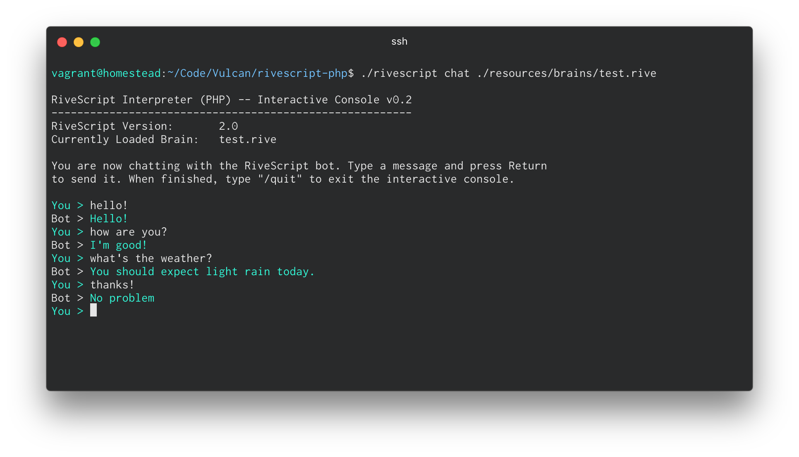

# RiveScript-PHP
[](https://github.com/vulcan-project/rivescript-php)
[](https://tldrlegal.com/license/mit-license)

This is a RiveScript interpreter library for PHP. See the below [Working Draft](#working-draft) section for more information.

The package follows the FIG standards PSR-1, PSR-2, and PSR-4 to ensure a high level of interoperability between shared PHP code.



## Quick Installation
Simply install the package through Composer.

```
composer require junker/rivescript
```

## Integration
The RiveScript PHP interpreter is framework agnostic. As such, the interpreter can be used as is with native PHP, or with your favorite framework.

---

# Working Draft

The RiveScript Working Draft (WD) is a document that defines the standards for how RiveScript should work, from an implementation-agnostic point of view. The Working Draft should be followed when contributing to the RiveScript-PHP interpreter. If any of the current implementations don't do what the Working Draft says they should, this is considered to be a bug and you can file a bug report or send a pull request.

A copy of the working draft can be found within the `resources` directory of this repository. You may also find the latest version on the RiveScript website at http://www.rivescript.com/wd/RiveScript.

# Roadmap

## Interpreter
- [x] Format
- [x] Whitespace
- [ ] Standard Global Variables
- [ ] Sort +Triggers
- [ ] Sort %Previous
- [ ] Sort Replies
- [ ] Syntax Checking

## Tag Priority
- [ ] Within BEGIN/Request
- [ ] Within +Trigger
- [ ] Within Replies

## Commands
- [ ] % Previous
- [x] ^ Continue
- [x] @ Redirect
- [x] * Condition
- [x] // Comment

### ! Definition
- [ ] version
- [ ] global
- [x] var
- [x] array
- [x] sub
- [x] person

### > Label
- [ ] begin
- [x] topic
- [ ] object

### + Trigger
- [x] Atomic
- [x] Wildcard
- [x] Alternation
- [x] Optional
- [x] Arrays
- [ ] Priority

### - Response
- [x] Atomic
- [x] Random
- [x] Weighted Random

## Tags
- [x] `<star>`
- [x] `<star1>` - `<starN>`
- [ ] `<botstar>`
- [ ] `<botstar1>` - `<botstarN>`
- [x] `<input>`
- [x] `<input1>` - `<input9>`
- [x] `<reply>`	
- [x] `<reply1>` - `<reply9`
- [x] `<id>`
- [x] `<bot>`
- [ ] `<env>`
- [x] `<get>`
- [x] `<set>`
- [ ] `<add>`
- [ ] `<sub>`
- [ ] `<mult>`
- [ ] `<div>`
- [x] `{topic=...}`
- [x] `{weight=...}`
- [ ] `{@...}`
- [ ] `<@>`
- [x] `{random}...{/random}`
- [ ] `{person}...{/person}`
- [ ] `<person>`
- [x] `{formal}...{/formal}`
- [ ] `<formal>`
- [x] `{sentence}...{/sentence}`
- [ ] `<sentence>`
- [x] `{uppercase}...{/uppercase}`
- [ ] `<uppercase>`
- [x] `{lowercase}...{/lowercase}`
- [ ] `<lowercase>`
- [ ] `{ok}`
- [ ] `\s`
- [ ] `\n`
- [ ] `\/`
- [ ] `\#`
